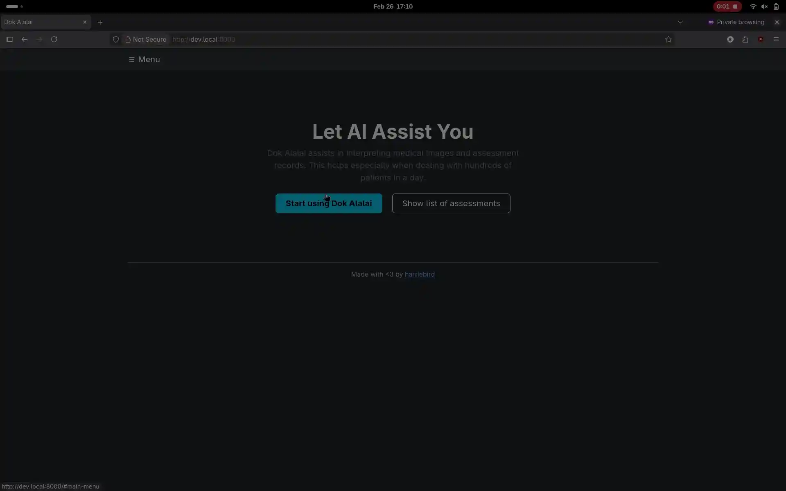

# dok-alalai

Dok Alalai assists in analyzing medical assessment information. This helps medical professionals
in determining possible findings and tests.

## Requirements

- [Docker](https://www.docker.com/)
- [Ollama](https://ollama.com/)
- [Python](https://www.python.org/)
- [uv](https://docs.astral.sh/uv/)

## Setup

### Development

#### Using Docker:

1. Install [Docker](https://docs.docker.com/engine/install/) or [Docker Desktop](https://docs.docker.com/desktop/).
2. Clone this repository.
3. Install [Ollama](https://ollama.com/download).
4. Create a copy of `config.env.example` and name it to `config.env`.
5. Modify or provide the configuration in the `config.env` file.
6. Run `docker compose -f docker-compose.dev.yml up` to build and serve the web application.
7. Go to `http://localhost:8000/` and enjoy!

## License

Code released under the [AGPLv3 License](LICENSE).
